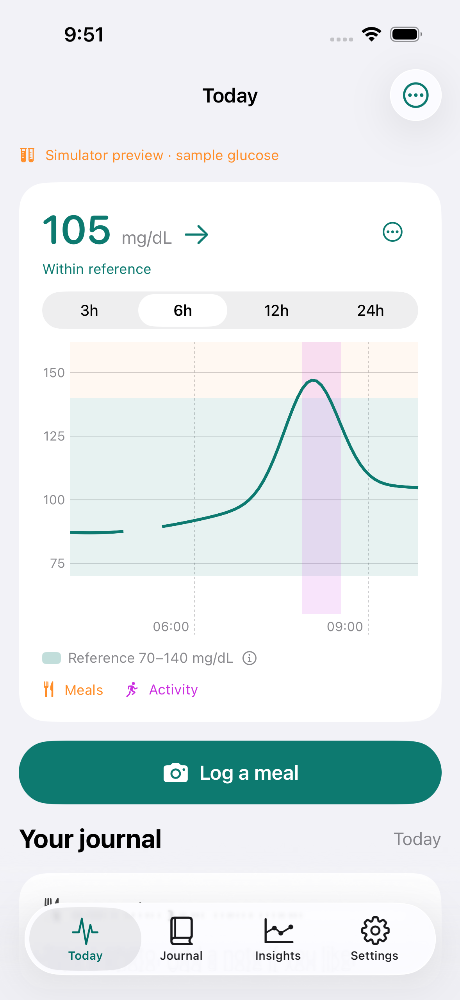
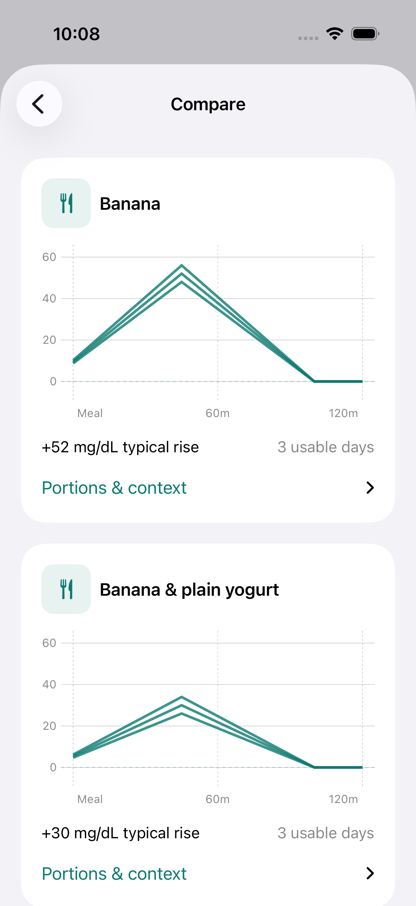
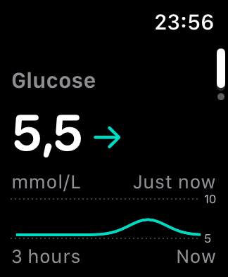
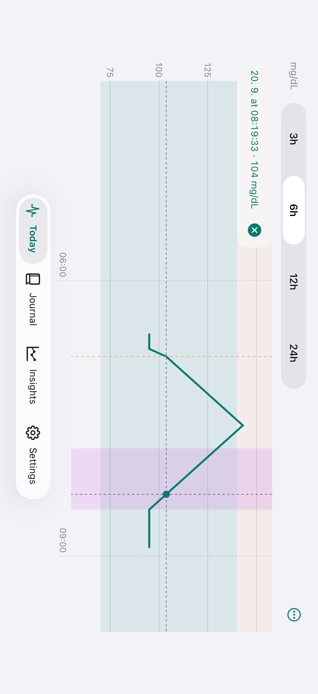

# Libre Debug

### Your meals. Your glucose. Your patterns.

Photograph a meal, add an optional note, and see the glucose response.

[Build & install](docs/DEVELOPMENT.md) · [Privacy](docs/PRIVACY.md) · [Credits](NOTICE.md)

  
  
  

*Simulator screenshots with synthetic data.*

## Capture. Compare. Learn.

1. **Snap and go.** Save a meal photo without waiting for AI.
2. **See the response.** Explore recorded glucose values; rotate for a wider chart.
3. **Compare repeats.** Find patterns across similar meals, with workouts and sleep as context.

Includes an Apple Watch companion, complications, widgets and Live Activity support.

## Why try it?

Curious about longevity? Explore your own patterns around familiar meals. Sinclair's CGM discussions are part of that motivation—not an endorsement or a validated protocol. Flatter glucose curves are **not proven to extend life**. [Evidence and limits](docs/EVIDENCE.md).

## Get started

Self-built and experimental. Tested with **Libre 2 Plus EU**; other sensors are not verified. [Build guide](docs/DEVELOPMENT.md).

Optional food AI uses your OpenAI key and sends meal photos and notes for analysis. Photos and notes work without it. [Data details](docs/PRIVACY.md).

Upgrade in place with the same signing and bundle identifiers—**don't uninstall** a working app.

For personal observation, not diagnosis or medication decisions. Comparisons concern whole meals, not proof that one ingredient caused a spike.

## Open source

Modified fork of [xDrip4iOS](https://github.com/JohanDegraeve/xdripswift) by Johan Degraeve and contributors. Changes: 24 August–20 September 2026. [GPL-3.0-or-later](LICENSE), without warranty. [Full notices](NOTICE.md).

This product includes software developed by the "Marcin Krzyzanowski" (http://krzyzanowskim.com/). Legacy icons: [Icons8](https://icons8.com/).

[Contribute](CONTRIBUTING.md) · [Documentation](docs/README.md) · [Report an issue](https://github.com/pepuscz/xdripswift/issues)
